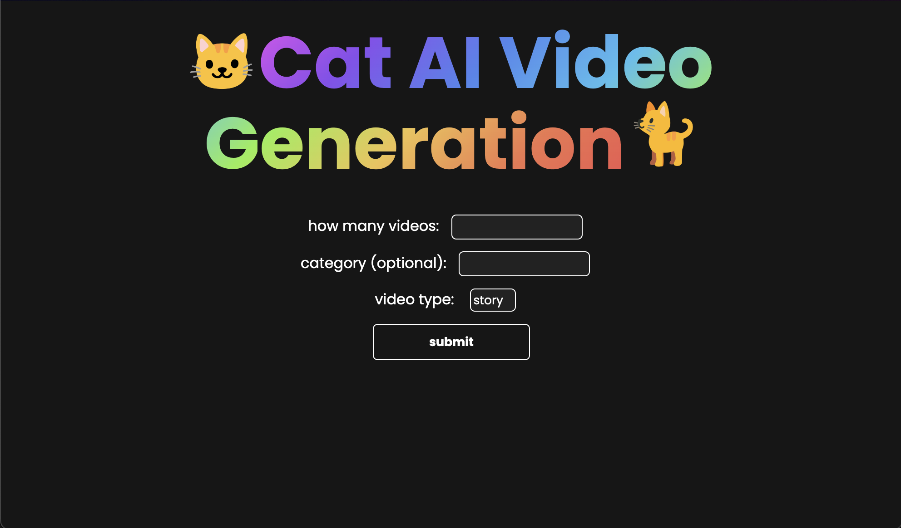

# Sad Cat AI Video Generation 🐈
Create a cat AI video by a catergory selection and a simple run in the terminal.
## Video example 🎥

## Setting Up 💾
1. clone this repo `git clone https://github.com/Ewan-Dev/sad-cat-ai.git`
2. install requirements `pip install -r requirements.txt`
3. in `main.py` assign yout YT channel login details `username = ''` and ` password = ''` if you want to automate the uploads
4. assign your YT STUDIO channel URL to the `channel_url` variable
## Run 🎬
1. run `python3 main.py` in this directory
2. the localhost address is printed in the terminal and open it for the frontend
3. (optional) in `main.py` you can change the values of `image_duration` and `images` to your liking but the deafults are `image_duration = 1.5 #seconds` and `images = 15`
4. enter values in the corresponding inputs and click submit
5. your final video will saved as **final[video index].mp4** in the `videos` folder and uploaded to YT
*(the videos and images will be deleted and replaced locally next time you run the code do be sure to copy it)*